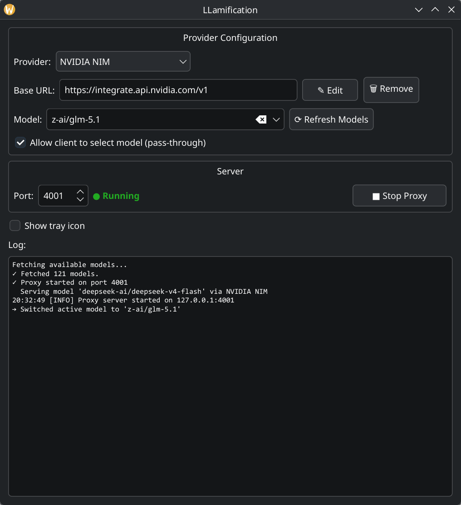

# LLamification



LLamification is a lightweight local proxy that makes any online LLM provider look like a local Ollama server. You configure it once with your provider's API endpoint and key, then point any Ollama-compatible tool (CLI, library, UI) at `http://localhost:4001` and it just works.

You can switch providers and models on the fly without restarting anything.

## Why this exists

I wanted something simpler than litellm for my use case: connecting online LLMs and making them pretend to be local Ollama. LLamification does exactly that -- no more, no less. It also lets you switch providers and models without touching config files or restarting services.

## Quick start

```bash
#For Arch Linux users, app is available on AUR

# Clone the repository
git clone https://github.com/magillos/LLamification.git
cd LLamification

# Install dependencies (pick one)

# Option A: Use your distro's package manager
#   Debian/Ubuntu: sudo apt install python3-pyqt6 python3-aiohttp python3-pyqt6.qtsvg
#   Fedora:        sudo dnf install python3-qt6 python3-aiohttp
#   Arch:          sudo pacman -S python-pyqt6 python-aiohttp

# Option B: Use pip inside a virtual environment (recommended for isolation)
python3 -m venv .venv
source .venv/bin/activate
pip install PyQt6 aiohttp

# Run the GUI to configure your provider, API key, and model
python3 -m llamification -g

# Start the proxy with your last settings (headless mode)
python3 -m llamification
```

### Optional alias

Add this to your `~/.bashrc` or `~/.zshrc`:

```bash
alias llamification="cd /path/to/LLamification && python3 -m llamification"
```

Then you can start the proxy by just typing `llamification` in your terminal.

## Usage

1. Run `python3 -m llamification -g` to open the GUI.
2. Add a provider (name, base URL, API key), then click "Refresh Models" to fetch the available models.
3. Select a model and click "Start Proxy".
4. The proxy now runs on `http://localhost:4001` and speaks the Ollama API.

The next time you run `python3 -m llamification` (without the `-g` flag), it starts headlessly with your last settings.

The default port is `4001` so you can run it alongside a real Ollama server without conflicts. Change the port in the GUI or in `~/.config/llamification/config.json`.

## Configuration

All configuration is stored in `~/.config/llamification/config.json`. Use the GUI to add providers, set API keys, select models, and mark favourites. No manual editing required.

## License

MIT
